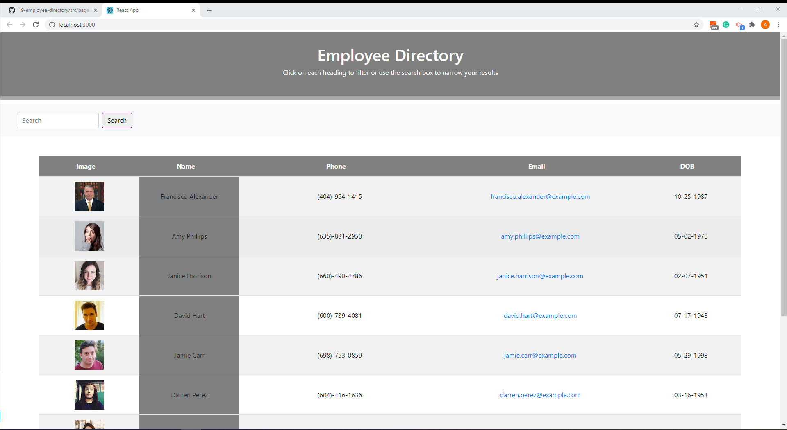

## By Araya Nawrath 

## Employee Directory

Overview: For this assignment, you'll create a employee directory with React. This assignment will require you to break up your application's UI into components, manage component state, and respond to user events.

## User Story

-- As a user, I want to be able to view my entire employee directory at once so that I have quick access to their information.

## Demo 

## Live Demo 

Here is the Heroku Link [here](https://employeetodo-directory.herokuapp.com/)

